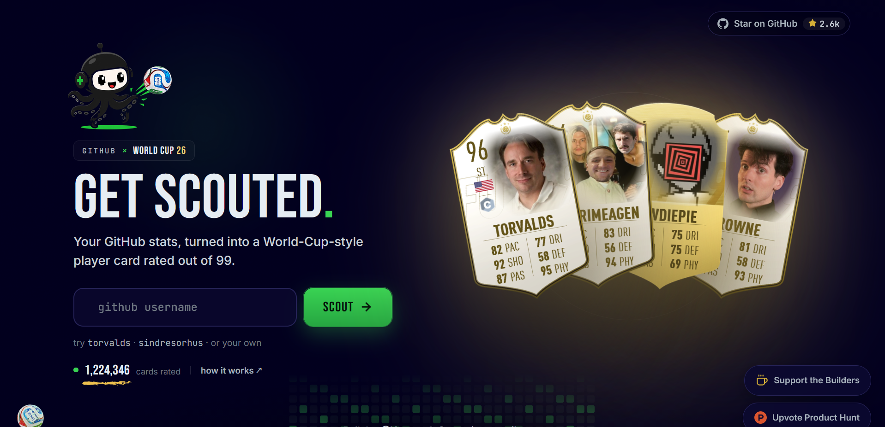

<div align="center">

# 🃏 ResumeFUT

### Your resume. Scouted like a football player.

Turn a resume into a **FUT-style player card rated out of 99** — with position, archetype, six scouting stats, playstyles, nationality, photo, downloads, sharing and Derby Mode.

<a href="https://resumefut.vercel.app"><strong>Live Demo ↗</strong></a> ·
<a href="https://github.com/Dhruv-Bisht/Resumefut"><strong>GitHub ↗</strong></a>

<br />


</div>

---

## ✨ What is ResumeFUT?

ResumeFUT takes the information already present in a resume and turns it into a football-style scouting card.

**Upload → Scout → Get your card → Share it → Derby against another resume.**

The interface is intentionally playful: the result is meant to feel like opening a player card rather than reading another boring resume score.

<div align="center">



<sub>Frontend direction: dark football-card aesthetic, bold scouting typography and a card-first experience.</sub>

</div>

> **Note:** The image above is a visual reference for the UI direction. The application itself is implemented in React/Next.js.

---

## 🏟️ Features

| Feature | What it does |
| --- | --- |
| 📄 **PDF scouting** | Extract resume text directly in the browser and generate a card |
| ✍️ **Paste mode** | Paste resume text when you don't have a PDF |
| 🃏 **Player card** | Overall rating, position, tier, six stats and archetype |
| 📷 **Card photo** | Add/change the player's photo directly from the card |
| 🌍 **Nationality** | Pick a nationality using the small flag control on the card |
| ⬇️ **Download** | Export the finished card as a PNG |
| 🔗 **Sharing** | Share the result to X or LinkedIn |
| ⚔️ **Derby Mode** | Keep your current card on screen and challenge it with another resume |
| ⭐ **GitHub** | Open the real ResumeFUT repository and see its current star count |
| 📊 **Card counter** | Tracks cards generated in the current browser |

---

## ⚽ The scouting stats

ResumeFUT produces six ratings from the resume text:

| Code | Stat | Looks at |
| :---: | --- | --- |
| **EXP** | Experience | Tenure, date ranges and seniority language |
| **SKL** | Skills | Recognized tools, technologies and skills |
| **LED** | Leadership | Management, ownership and team language |
| **IMP** | Impact | Quantified achievements and results-driven language |
| **EDU** | Education | Degrees and certifications |
| **VER** | Versatility | Number of different role/industry buckets detected |

The scoring engine is deliberately readable and deterministic, so contributors can inspect and extend the rules without needing a model pipeline.

<details>
<summary><strong>🎮 How a card is generated</strong></summary>

1. A user uploads a PDF or pastes resume text.
2. PDF text is extracted in the browser.
3. The text is sent to the app's `/api/analyze` route.
4. `lib/scoring.js` calculates the six stats.
5. The dominant signals determine position and archetype.
6. The UI renders the final player card.
7. The user can edit their name and customize the photo/nationality directly on the card.

</details>

---

## ⚔️ Derby Mode

Derby Mode is now **card-first**.

You don't leave your scouting result to start a derby:

```text
Your Resume
    ↓
Your Player Card
    ↓
⚔️ Derby Mode
    ↓
Your card stays visible + enter opponent resume
    ↓
Opponent card
    ↓
HEAD-TO-HEAD STAT BATTLE
```

Each of the six stats is compared. The player who wins the most categories wins the derby. If the category score is tied, overall rating breaks the tie.

The old standalone `/derby` upload flow has been removed from the main experience so the derby starts from an existing card.

---

## 🖼️ Card customization

The card itself owns the profile customization controls.

- **📷 Camera icon** → add or replace the photo.
- **🌍 Flag icon** → choose nationality.
- **Name** → edit it from the scouting result.
- **Download** → export the card after customization.

This keeps the first page focused on one job: **submit the resume**.

---

## 🧱 Project structure

```text
Resumefut/
├── components/
│   ├── AttributesPanel.js
│   ├── Header.js
│   ├── PlayerCard.js
│   ├── ResumeUploader.js
│   ├── ScoutingMetrics.js
│   └── Tooltip.js
├── lib/
│   ├── countries.js
│   ├── extractPdfText.js
│   └── scoring.js
├── pages/
│   ├── api/
│   │   └── analyze.js
│   ├── index.js
│   └── derby.js
├── styles/
│   └── globals.css
├── docs/
│   └── assets/
│       └── frontend-reference.png
├── next.config.js
├── package.json
└── README.md
```

---

## 🚀 Run locally

### 1. Clone

```bash
git clone https://github.com/Dhruv-Bisht/Resumefut.git
cd Resumefut
```

### 2. Install

```bash
npm install
```

### 3. Start development server

```bash
npm run dev
```

Open **http://localhost:3000**.

### Production build

```bash
npm run build
npm start
```

---

## 🛠️ Tech stack

- **Next.js 14** — application framework
- **React 18** — UI
- **Tailwind CSS** — styling
- **pdfjs-dist** — browser-side PDF text extraction
- **html-to-image** — card PNG export
- **JavaScript** — scoring and UI logic

---

## 🔍 Scoring engine

The core scoring logic lives in [`lib/scoring.js`](./lib/scoring.js).

The engine uses transparent keyword, regex and signal-based rules. That makes it intentionally easy to understand and modify.

For example:

```text
Resume text
    │
    ├── date ranges ───────────→ EXP
    ├── skill keywords ────────→ SKL
    ├── leadership language ───→ LED
    ├── quantified results ────→ IMP
    ├── degrees/certificates ──→ EDU
    └── industry buckets ──────→ VER
                                      │
                                      ↓
                              Overall / Position
                                      │
                                      ↓
                               Player Card 🃏
```

<details>
<summary><strong>🧠 Want to extend the engine?</strong></summary>

Good contribution ideas:

- Improve date-range parsing.
- Add more skills and tools.
- Add industry-specific keyword groups.
- Improve name extraction.
- Add more archetypes.
- Improve the card visual system.
- Add more card tiers.
- Build shareable card pages.
- Add automated tests for scoring edge cases.

</details>

---

## ⭐ GitHub button

The **Star on GitHub** button points to the actual repository:

`https://github.com/Dhruv-Bisht/Resumefut`

The displayed star count is fetched from the repository so it isn't a hard-coded number. Clicking the button takes the user to GitHub, where they can authenticate and star the repository.

> GitHub does not allow an unauthenticated website button to silently star a repository on a user's behalf. The correct UX is to send the user to the repository's official GitHub page.

---

## 📈 Card counter

The landing page shows how many cards have been generated **in the current browser** using `localStorage`.

This avoids pretending that the project has a global database-backed counter when it currently doesn't. A true global counter would require persistent server-side storage.

---

## 🤝 Contributing

Pull requests are welcome.

1. Fork the repository.
2. Create a branch:
   ```bash
   git checkout -b feature/my-feature
   ```
3. Make your changes.
4. Test the production build:
   ```bash
   npm run build
   ```
5. Commit and push.
6. Open a pull request.

If you're changing scoring rules, explain the new signal and include examples where possible.

---

## 📜 License

MIT — see [`LICENSE`](./LICENSE).

---

<div align="center">

### Built for people who think resumes deserve better than a PDF. ⚽🃏

**ResumeFUT** · Scout yourself.

</div>
