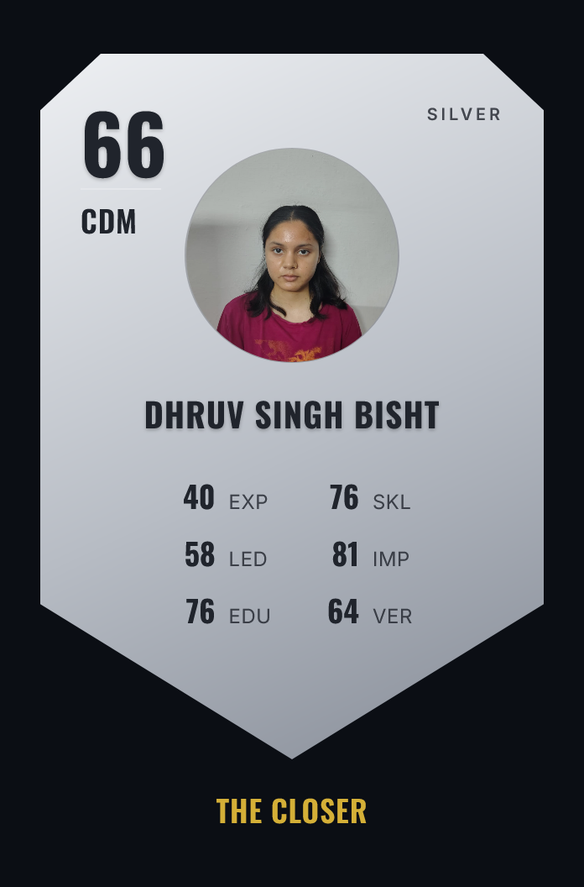

<div align="center">

# ResumeFUT

### GET SCOUTED. ⚽

**Your resume, turned into a World-Cup-style player card rated out of 99.**

<a href="https://resumefut.vercel.app"><strong>Live Demo ↗</strong></a> ·
<a href="https://github.com/Dhruv-Bisht/Resumefut"><strong>GitHub ↗</strong></a>

<br />


</div>

---

## 🃏 What is ResumeFUT?

ResumeFUT turns a resume into a football-style scouting card.

```text
RESUME
  ↓
SCOUT
  ↓
PLAYER CARD
  ↓
CUSTOMIZE PHOTO + NATIONALITY
  ↓
DOWNLOAD / SHARE / ⚔️ DERBY
```

<div align="center">




</div>

---

## ✨ Features

| Feature | Description |
|---|---|
| 📄 Resume PDF | Upload a PDF from the Scout popup and extract its text |
| ✍️ Paste text | Paste a resume directly when a PDF isn't available |
| 🃏 Player card | Overall, position, tier, six stats and archetype |
| 📷 Photo | Add a photo using the small camera icon inside the card |
| 🌍 Nationality | Choose a flag from a searchable nationality picker inside the card |
| ⬇️ PNG export | Download the finished card with the selected flag and photo |
| ⭐ GitHub | Opens the real repository and displays its current star count |
| ⚔️ Derby Mode | Keep your card on screen while scouting an opponent |
| 🔗 Profile enrichment | Public GitHub and LeetCode links found in a resume can add extra signals |
| 💡 How it works | Opens a compact scouting explainer instead of navigating away |

---

## 🏟️ The first screen

The landing page is deliberately card-first:

- **GET SCOUTED.** is the main visual.
- The sample cards are compact so they don't dominate the viewport.
- The resume field is a single clean CTA: **`resume.pdf or paste text`**.
- Clicking it opens the **Build Your Card** popup.
- The card counter sits directly under the CTA.
- **how it works ↗** opens a mini scouting window.
- **Star on GitHub** links directly to the repository.

---

## 📊 The six stats

| Code | Stat | Reads |
|:---:|---|---|
| **EXP** | Experience | Years, role history and seniority |
| **SKL** | Skills | Tools, technologies and skill breadth |
| **LED** | Leadership | Ownership, mentoring and management language |
| **IMP** | Impact | Quantified achievements and results |
| **EDU** | Education | Degrees and certifications |
| **VER** | Versatility | Range of industries and roles |

The scoring rules live in [`lib/scoring.js`](./lib/scoring.js), making the system straightforward to inspect and extend.

---

## 🔗 GitHub + LeetCode enrichment

If a resume contains a public profile URL such as:

```text
https://github.com/username
https://leetcode.com/u/username/
```

ResumeFUT extracts the username and looks up available public profile information while generating the card.

### GitHub signals

Public profile information can contribute:

- public repository count
- followers
- repository stars
- GitHub account age

### LeetCode signals

Available public profile information can contribute:

- problems solved
- public ranking

These signals are combined with the resume's own text instead of replacing it.

---

## ⚔️ Derby Mode

Derby starts **after your card already exists**.

```text
YOUR RESUME
    ↓
YOUR CARD ───────────────┐
                         │
                    ⚔️ DERBY MODE
                         │
                         ↓
                 ENTER OPPONENT RESUME
                         │
                         ↓
                OPPONENT PLAYER CARD
                         │
                         ↓
                  STAT-BY-STAT BATTLE
```

Your original card stays locked on the pitch while the opponent is scouted. The six stats are compared one by one and the player winning the most categories takes the derby.

---

## 🌍 Nationality picker

Nationality is part of the card rather than the landing-page form.

The picker includes:

- a compact flag button
- a searchable country list
- a scrollable results area
- a clean selection state
- a flag that remains visible in the exported PNG

The visible flag is intentionally separated from the picker controls during export, so the download contains the nationality.

---

## 💡 The Scout's Eye

Click **how it works ↗** on the landing page to open the mini scouting window.

It explains:

> **WE DON'T JUST RATE YOU. WE READ YOU.**

Six signals are read from the resume and weighed against each other to find your shape. That shape becomes your card — so two people with similar numbers can still walk out with different players.

The window covers:

- **Measured against you** — how the signals interact inside one profile.
- **Every card has a shape** — why strengths and weaknesses change the archetype.
- **The 90s are earned** — why a strong card needs depth across multiple signals.
- **Linked profiles** — how public GitHub and LeetCode links can add extra context.
- **What feeds the six** — a quick explanation of EXP, SKL, LED, IMP, EDU and VER.

---

## 🧱 Project structure

```text
Resumefut/
├── components/
│   ├── AttributesPanel.js
│   ├── Header.js
│   ├── PlayerCard.js
│   ├── ResumeUploader.js
│   ├── ScoutingMetrics.js
│   └── Tooltip.js
├── lib/
│   ├── countries.js
│   ├── extractPdfText.js
│   └── scoring.js
├── pages/
│   ├── api/
│   │   └── analyze.js
│   ├── derby.js
│   └── index.js
├── styles/
│   └── globals.css
├── docs/
│   └── assets/
│       └── frontend-reference.png
├── next.config.js
├── package.json
└── README.md
```

---

## 🚀 Run locally

### 1. Clone

```bash
git clone https://github.com/Dhruv-Bisht/Resumefut.git
cd Resumefut
```

### 2. Install dependencies

```bash
npm install
```

### 3. Start development

```bash
npm run dev
```

Open `http://localhost:3000`.

### Production

```bash
npm run build
npm start
```

---

## 🛠️ Tech stack

- **Next.js 14**
- **React 18**
- **Tailwind CSS**
- **pdfjs-dist** for PDF text extraction
- **html-to-image** for PNG card export
- **GitHub public API** for linked GitHub profiles
- **LeetCode public GraphQL endpoint** for linked LeetCode profiles

---

## 🤝 Contributing

ResumeFUT is designed to be easy to extend.

Good areas for contributions:

- Add more countries.
- Improve resume parsing.
- Add more skill keywords.
- Improve GitHub/LeetCode enrichment.
- Add more card tiers.
- Add new archetypes.
- Improve Derby Mode.
- Add tests for scoring edge cases.
- Improve card designs and animations.

```bash
git checkout -b feature/my-change
git add .
git commit -m "feat: improve scouting experience"
git push origin feature/my-change
```

Then open a pull request.

---

## 📄 License

MIT — see [`LICENSE`](./LICENSE).

---

<div align="center">

### Resume in. Card out. 🃏

**Get scouted.**

</div>
