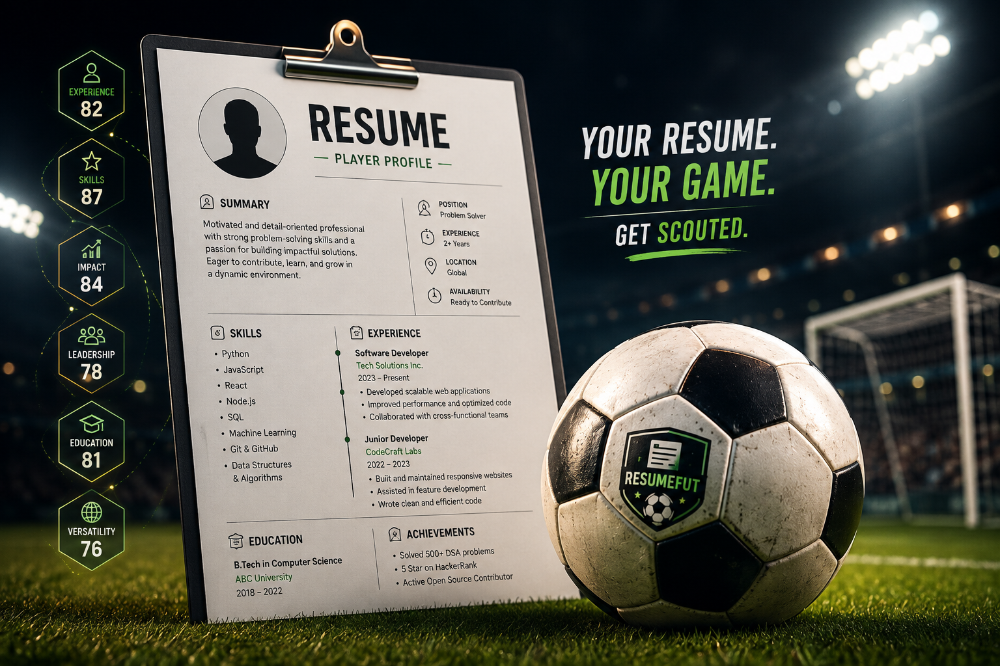

<div align="center">

# ResumeFut ⚽

**your resume, rated out of 99**

Turn your resume into a **World-Cup / Ultimate-Team-style player card**. Upload a resume, let ResumeFut scout the profile, enrich the score with public GitHub and LeetCode data when available, and take the card into Derby Mode.



<br>

**Built by [@DhruvBisht](https://www.linkedin.com/in/dhruv-bisht-90907a348)**

</div>

---

## ⚽ What it does

ResumeFut turns a resume into a football-style scouting card rated out of **99**.

Upload a resume PDF or paste resume text. ResumeFut extracts the candidate's profile, evaluates the resume signals, and generates a card with:

- 🎴 **Overall rating** out of 99
- ⚽ **Football position**
- 🏷️ **Player archetype**
- 📊 **Six scouting statistics**
- 🌍 **Nationality**
- 🖼️ **Player photo**
- 💻 **GitHub enrichment**
- 🧩 **LeetCode enrichment**
- ⚔️ **Derby Mode**
- 📥 **Downloadable player card**

The goal isn't to replace a recruiter or make a hiring decision. It is a fun, visual way to turn technical profiles into something that feels like a football player card.

---

## 🃏 Player Card

A generated card contains six core signals:

| Stat | What it represents |
|---|---|
| **EXP** | Experience, tenure and seniority |
| **SKL** | Technical and professional skills |
| **LED** | Leadership and ownership |
| **IMP** | Quantified achievements and measurable impact |
| **EDU** | Education and certifications |
| **VER** | Versatility across technologies, domains and experience |

The six signals are combined to produce the final **OVR** rating.

Your card can also include a small **nationality flag** and **profile photo**, directly inside the player card.

---

## 🔎 GitHub + LeetCode Scouting

ResumeFut can detect public profile links inside a resume.

### GitHub

If a GitHub profile is present, public profile information can be used as an additional scoring signal, such as:

- Public repositories
- Repository activity
- Stars
- Followers
- Account/profile history

### LeetCode

If a LeetCode profile is present, public competitive-programming information can contribute to the profile, such as:

- Problems solved
- Difficulty distribution
- Contest information
- Public ranking

This means the card can reflect more than what is written in the resume when the candidate has linked public technical profiles.

---

## 🤖 Machine-Learning Scoring

ResumeFut uses a lightweight machine-learning scoring layer to calibrate the final card rating.

The pipeline is conceptually:

```text
Resume PDF / Resume Text
          │
          ▼
     Resume Parser
          │
          ├──────────────► GitHub profile
          │
          └──────────────► LeetCode profile
          │
          ▼
    Feature Extraction
          │
          ▼
   Resume + Profile Signals
          │
          ▼
    ML Rating Calibration
          │
          ▼
     Player Card / 99
```

The ML layer is intended as a **fun scoring mechanism**, not a real employability or hiring prediction.

---

## ⚔️ Derby Mode

Think your card is better than your friend's?

Take them into **Derby Mode**.

```text
YOUR CARD
    │
    │
    ├──────── ⚔️ DERBY ────────┤
    │                          │
    ▼                          ▼
Your existing card       Opponent resume
                              │
                              ▼
                       Opponent player card
                              │
                              ▼
                       Stat-by-stat battle
```

Your current card stays on screen while the opponent's resume is entered.

The opponent can have their own:

- 🖼️ Photo
- 🌍 Nationality
- 📊 Six stats
- ⭐ Overall rating
- 🏷️ Archetype

Then compare both players head-to-head.

---

## 🛡️ Resume Validation

ResumeFut is intentionally strict about what can become a card.

A document must look like an actual resume before scoring begins.

### Current safeguards

- PDF resumes can be **a maximum of 3 pages**
- Books and long documents are rejected
- Admit cards and hall tickets are rejected
- Exam/registration documents are rejected
- Documents with strong book/report signals are rejected
- Resume structure is checked before scoring
- Resume-like sections and candidate information are required
- Pasted text is validated as well

This prevents an arbitrary PDF such as a textbook, book, exam document, or report from accidentally becoming a player card.

---

## 🧠 How the scouting works

ResumeFut extracts signals from the candidate's profile and maps them into football-style attributes.

### EXP — Experience

Looks at:

- Work history
- Tenure
- Seniority
- Relevant experience

### SKL — Skills

Looks at:

- Programming languages
- Frameworks
- Tools
- Databases
- Cloud technologies
- AI/ML technologies
- Other technical skills

### LED — Leadership

Looks for evidence of:

- Team ownership
- Leadership
- Management
- Mentoring
- Responsibility
- Project ownership

### IMP — Impact

Looks for:

- Percent improvements
- Scale
- Users
- Performance gains
- Revenue/cost impact
- Quantified achievements

### EDU — Education

Looks at:

- Degrees
- Universities
- Certifications
- Academic background

### VER — Versatility

Looks at the range of:

- Technologies
- Domains
- Projects
- Industries
- Professional experience

---

## 🏆 Card Tiers

Cards can progress through different finishes depending on their overall rating.

```text
BRONZE
   ↓
SILVER
   ↓
GOLD
   ↓
IN-FORM
   ↓
TOTY
   ↓
ICON
```

The rating is designed around the ResumeFut scoring system and should be treated as a game-like representation of a profile.

---

## 🖼️ Card Customization

Your generated card supports:

- Profile photo
- Nationality
- Candidate name
- Position
- Overall rating
- Six player stats
- Archetype
- Card finish

Nationality is represented as a **small flag inside the card**, rather than taking up space in the main interface.

The card can also be downloaded and shared.

---

## 🚀 Run it locally

### Clone the repository

```bash
git clone https://github.com/Dhruv-Bisht/Resumefut.git
cd Resumefut
```

### Install dependencies

```bash
npm install
```

### Development

```bash
npm run dev
```

Open the local development server shown by Next.js.

### Production

```bash
npm run build
npm start
```

---

## 🧱 Built with

- **Next.js**
- **TypeScript**
- **React**
- **Tailwind CSS**
- **Machine Learning**
- **GitHub public profile data**
- **LeetCode public profile data**
- **PDF resume parsing**
- **Client-side card rendering**

---

## 📁 Project structure

```text
ResumeFut/
├── app/
│   ├── api/
│   ├── components/
│   └── ...
├── lib/
│   ├── scoring/
│   ├── validation/
│   ├── mlScorer.*
│   └── ...
├── ml/
│   └── train_model.py
├── public/
├── docs/
│   └── assets/
├── README.md
├── package.json
└── ...
```

---

## 🎯 Why ResumeFut?

Traditional resumes are useful.

Football cards are more fun.

ResumeFut combines the two:

```text
RESUME
  +
TECHNICAL PROFILE
  +
FOOTBALL CARD
  =
RESUMEFUT ⚽
```

Instead of looking at a wall of text, you get a profile that can be quickly understood, compared and shared.

---

## 🤝 Contributing

Contributions are welcome.

If you want to improve ResumeFut:

1. Fork the repository
2. Create a feature branch

```bash
git checkout -b feature/my-feature
```

3. Make your changes
4. Test them locally
5. Commit your changes

```bash
git add .
git commit -m "feat: add my feature"
```

6. Push the branch

```bash
git push origin feature/my-feature
```

7. Open a Pull Request

---

## 👨‍💻 Built by

<div align="center">

### **Dhruv Bisht**

BE (AIML) · Developer · Builder

[LinkedIn](https://www.linkedin.com/in/dhruv-bisht-90907a348) · [GitHub](https://github.com/Dhruv-Bisht)

**Built by @DhruvBisht ⚽**

</div>

---

<div align="center">

**ResumeFut — Get Scouted. ⚽**

</div>
